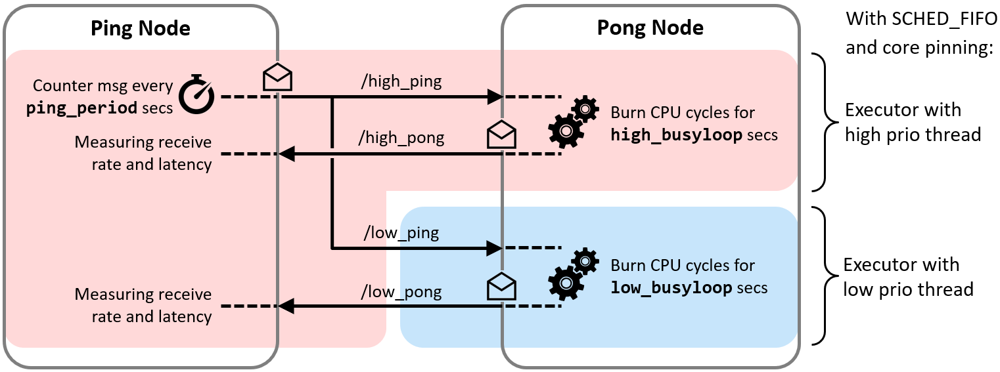

# Re-Design Considerations
* Make all options parameters (except for i, o, io).
* Always pin threads to first CPU ?! 
* No launch files necessary!
* Implement one main.cpp which contains a generic main function configurable by preprocessor defines to create three
          executables ping_node_only, pong_node_only, ping_and_pong_node
* Use [ms] instead of [us] for durations/rates in parameters but allow float values?
* Ensure that executables also run w/o sudo but that warnings to user appear (in case that core pinning or low prioritization of fails).


# cbg_executor_demo

This package provides a small example for the use of the Callback-group-level Executor concept.

The Callback-group-level Executor leverages the callback-group concept in rclcpp by introducing real-time profiles such as RT-CRITICAL and BEST-EFFORT in the callback-group API (i.e. [rclcpp/callback_group.hpp](https://github.com/ros2/rclcpp/blob/master/rclcpp/include/rclcpp/callback_group.hpp)). Each callback requiring specific real-time guarantees, when created, may therefore be associated with a dedicated callback group. With this in place, the Executor class and depending classes (e.g., for memory allocation) were enhanced to operate at a finer, callback-group-level granularity.

This allows a single node to have callbacks with different real-time profiles assigned to different Executor instances – within one process. Thus, an Executor instance can be dedicated to one or few specific callback groups and the Executor’s thread (or threads) can be prioritized according to the real-time requirements of these groups. For example, all time-critical callbacks may be handled by an "RT-CRITICAL" Executor instance running at the highest scheduler priority.

As a proof of concept, we implemented a small test bench in the present package *cbg_executor_demo*. The test bench comprises a Ping node and a Pong node which exchange real-time and best-effort messages simultaneously with each other. Each class of messages is handled with a dedicated Executor, as illustrated in the following figure.



The Ping node can be configured to send messages at a configured rate. The Pong node takes these ping messages and replies each of them. Before sending the reply, it can be configured to burn cycles (thereby varying the processor load) to simulate some message processing. We provide bash scripts to test intra-process and inter-process communication scenarios, wherein the nodes are co-located either in one process or two processes, respectively. These scripts also vary the message rates and processor loads. After each run, the Ping node outputs the measured throughput of real-time and best effort messages.


## Running the test bench

After building the test bench with [colcon](https://github.com/ros2/ros2/wiki/Colcon-Tutorial), the Ping and Pong nodes may be either started in one process or in two processes. Please note that the test bench requires sudo privileges to be able to change the thread priorities using `pthread_setschedparam(..)`. Start the executable by

```
ros2 run cbg_executor_demo ping-pong args...
```

where `args...` are five or six arguments as follows:

```
[type] [rt_ping_period_us] [be_ping_period_us] [rt_busyloop_us] [be_busyloop_us] [cpu_id]

type: determines the nodes included in this process:
  i: ping node only
  o: pong node only
  io: ping node and pong node

rt_ping_period_us: microseconds between publishing of ping messages by real-time thread
                   in ping node
be_ping_period_us: microseconds between publishing of ping messages by best-effort
                   thread in ping node
rt_busyloop_us:    microseconds of computation by real-time thread in pong node before
                   answering with pong
be_busyloop_us:    microseconds of computation by best-effort thread in pong node before
                   answering with pong
cpu_id (optional): pins both, real-time thread and best-effort thread, to the given cpu
```

When using type `i`, a second process with type `o` has to be started simultaneously.

The shell run\* scripts in this folder run various experiments in sequence. For pertinent results, we propose to use the [PREEMPT_RT patch](https://wiki.linuxfoundation.org/realtime/start) for the Linux kernel.


## Implementation Details

The algorithms of the Ping node and of the Pong node are factored out into classes [_PingNode_](include/PingNode.hpp) and [_PongNode_](include/PongNode.hpp) - configurable with regard to the real-time profile and the topic prefix. Thus, the Ping node contains two instances of the _PingNode_ and the Pong node contains two instances of _PongNode_. (And the test bench could be easily extended to more than two ping-pong paths.)

The PingNode contains a timer for sending the ping messages and a subscription for the corresponding pong messages. Also, it records the number of messages being sent and received and measures the roundtrip time.

The PongNode contains a subscription for the ping messages and a publisher for the corresponding pong messages. On receiving a ping message, it calls the `PongNode::burn_cpu_cycles()` functions to simulate a given processing time before replying with a pong.

The Ping and Pong nodes, the two executors, etc. are composed and configured in the `main(..)` function of [main.cpp](main.cpp). This function also starts and ends the experiment for a predefined duration and prints out the throughput and latency statistics.
