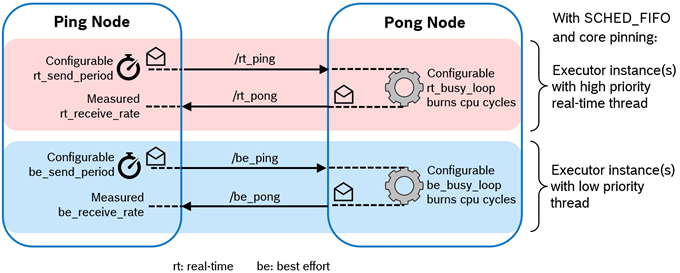

# cbg_executor_demo

This package provides a small demo for the use of the Callback-group-level Executor concept. This concept was developed in 2018 and has been integrated in ROS 2 mainline in 2020, i.e. it is available in ROS 2 Rolling.

This concept does not add a new Executor but leverages the callback-group concept for refining the Executor API to callback-group-level granularity. This allows a single node to have callbacks with different real-time requirements assigned to different Executor instances – within one process. Thus, an Executor instance can be dedicated to one or few specific callback groups and the Executor’s thread (or threads) can be prioritized according to the real-time requirements of these groups. For example, all real-time-critical callbacks may be handled by an Executor instance based on an thread running at the highest scheduler priority.

## Introduction to demo

As a proof of concept, we implemented a small demo and test bench in the present package *cbg_executor_demo*. The demo comprises a _Ping Node_ and a _Pong Node_ which exchange messages on two communication paths simultaneously. There are two topics _high\_ping_ and _high\_pong_ for the high priority path and _low\_ping_ and _low\_pong_ for the low priority path.



The Ping Node can be configured to send ping messages on both paths simultaneously at a configured rate. The Pong Node takes these ping messages and replies each of them. Before sending the reply, it burns a parameterizable number of CPU cycles (thereby varying the processor load) to simulate some message processing.

 In the Ping Node, all callbacks (i.e., for the timer for sending the ping messages and for the two subscription on receiving the pong messages) are handled in one callback group and thus Executor instance. However, in the Pong Node, the two callbacks that process the incoming ping messages and answer with a pong message are assigned to two different callback groups. In the main function, these two groups are distributed to two Executor instances and threads. Both threads are pinned to the same CPU and thus share its processing power, but with different scheduler priorities following the names _high_ and _low_.

## Running the demo

After building the demo with [colcon](https://github.com/ros2/ros2/wiki/Colcon-Tutorial), the Ping and Pong Nodes may be either started in one process or in two processes. Please note that the demo requires sudo privileges to be able to change the thread priorities using `pthread_setschedparam(..)`.

Running the two nodes in one process:

```
sudo bash
source /opt/ros/rolling/setup.bash
source install/local_setup.bas
ros2 run cbg_executor_demo ping_and_pong_node
```

Running the two nodes in separate processes:

```
sudo bash
...
ros2 run cbg_executor_demo ping_node_only
```

```
sudo bash
...
ros2 run cbg_executor_demo pong_node_only
```

You should start the two processes simultaneously as the experiment runtime is just 10 seconds.

## Parameters

There are three parameters to configure the experiment:

* `ping_period` -- period (double value in seconds) for sending out pings on the topics _high\_ping_ and _low\_ping_ simultaneously in the Ping Node.
* `high_busyloop` -- duration (double value in seconds) for burning CPU cycles on receiving a message from _high\_ping_ in the Pong Node.
* `low_busyloop` -- duration (double value in seconds) for burning CPU cycles on receiving a message from _low\_ping_ in the Pong Node.

The default values are 0.01 seconds for all three parameters.

Example for changing the values on the command line:

```bash
ros2 run cbg_executor_demo ping_and_pong_node --ros-args -p ping_period:=0.033 -p high_busyloop:=0.025
```

## Implementation Details

The Ping Node and the Pong Node are implemented in two classes [_PingNode_](include/PingNode.hpp) and [_PongNode_](include/PongNode.hpp), respectively. In addition to the mentioned timer and subscriptions, the PingNode class provides a function `print_statistics()` to print statistics on the number of sent and received messages on each path and the average round trip times. To burn the specified number of CPU cycles, the PongNode class contains a function `burn_cpu_cycles(duration)` to simulate a given processing time before replying with a pong.

The Ping and Pong nodes, the two executors, etc. are composed and configured in the `main(..)` function of [main.cpp](main.cpp). This function also starts and ends the experiment for a duration of 10 seconds and prints out the throughput and RTT statistics.
